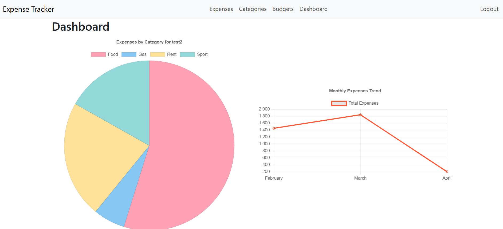
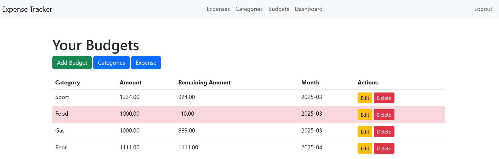
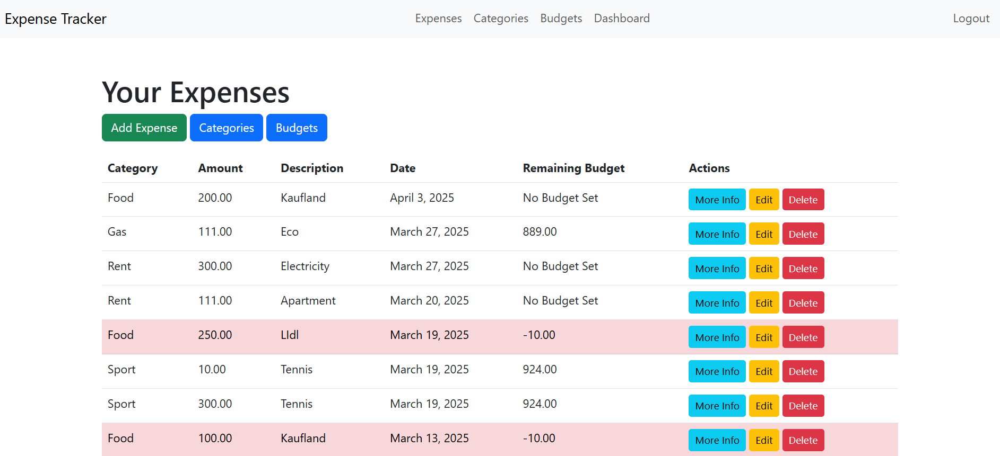

# Expense Tracker

## Project Description
This Expense Tracker web application allows users to track their daily expenses, set monthly budgets, and visualize their spending patterns. Users can create an account, log in, and manage their expenses with categories, all while keeping an eye on their budgets via detailed charts.

## Features
- **Expense Management**: Add, edit, and delete expenses with categories.
- **Budget Management**: Add, edit, and delete budget for categories and months.
- **Dashboard**: A dynamic dashboard showing:
  - **Total Expenses for the Month**
  - **Remaining Budget**
  - **Spending Trends**
- **Charts**: Visual representations of spending by category and monthly trends.
- **User Authentication**: Login and registration functionality for user-specific data.

## Technologies Used
- Django
- Chart.js
- Bootstrap
- SQLite

## Screenshots
Dashboard:



Budget:



Expenses:



## Installation

1. Clone this repository:
   ```bash
   git clone https://github.com/kirill2ll/Django.git
   ```
2. Install the required dependencies:
   ```bash
   pip install -r requirements.txt
   ```
3. Run the migrations:
   ```bash
   python manage.py migrate
   ```
4. Create a superuser:
   ```bash
   python manage.py createsuperuser
   ```
5. Run the development server:
   ```bash
   python manage.py runserver
   ```
6. Visit the app at `http://127.0.0.1:8000/` in your browser.

## Screenshots
- [Insert screenshots here]

## Future Improvements
- Adding recurring expense tracking.
- Budget alerts (e.g., when the user exceeds their budget).
- Exporting expense data to CSV or Excel.

## License
This project is licensed under the MIT License.
